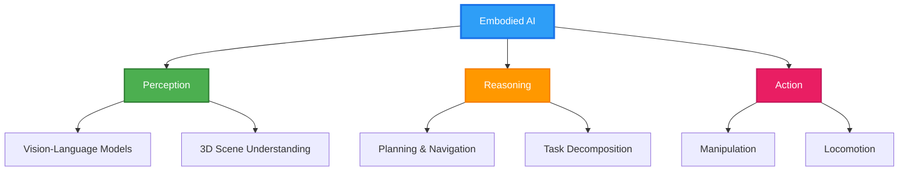

<div align="center">

# 👋 Hi there, I'm HQYang (Noietch)


### 🔭 Currently Working On
**Embodied Intelligence** · **Robot Learning** · **Vision-Language-Action Models**

[](https://github.com/Noietch/epog)
[](https://github.com/Noietch/ResearchClaw)

</div>

---

## 🤖 Research Interests

```python
class EmbodiedAIResearcher:
    def __init__(self):
        self.name = "HQYang"
        self.location = "Beijing, China 🇨🇳"
        self.education = "Beihang University (BUAA)"
        self.focus_areas = [
            "Embodied AI & Robot Learning",
            "Vision-Language-Action Models",
            "Open-Vocabulary Object Detection",
            "Scene Understanding & Navigation",
            "Multi-Modal Perception"
        ]

    def current_projects(self):
        return {
            "EPOG": "Integrated Exploration and Sequential Manipulation on Scene Graphs",
            "ResearchClaw": "AI-Powered Research Assistant Desktop App",
            "Embodied_Intelligence": "Building agents that perceive, reason, and act"
        }

    def daily_routine(self):
        return ["🔬 Research", "💻 Code", "📚 Read Papers", "🤔 Think", "🚀 Build"]
```

---

## 🛠️ Tech Stack

<div align="center">

### 🧠 AI & Robotics


### 💻 Development


### 🔧 Tools & Platforms


</div>

---

## 📊 GitHub Stats

<div align="center">


</div>

<div align="center">

[](https://git.io/streak-stats)

</div>

---

## 🌟 Featured Projects

<div align="center">

<a href="https://github.com/Noietch/epog">
  
</a>

<a href="https://github.com/Noietch/ResearchClaw">
  
</a>

</div>

---

## 🎯 Research Focus: Embodied Intelligence

<div align="center">



</div>

### 🔬 Key Areas

- **🎯 Open-Vocabulary Object Detection**: Bridging vision and language for flexible object recognition
- **🗺️ Scene Graph Generation**: Structured understanding of spatial relationships
- **🤝 Multi-Modal Learning**: Integrating vision, language, and action signals
- **🚶 Embodied Navigation**: Teaching agents to explore and interact with environments
- **🦾 Robot Manipulation**: From perception to precise control

---

## 📫 Connect With Me

<div align="center">

[](https://github.com/Noietch)
[](mailto:your.email@example.com)
[](https://twitter.com/your_handle)
[](https://linkedin.com/in/your-profile)

</div>

---

<div align="center">

### 💭 Quote of the Day

*"The best way to predict the future is to build it."*

---


**⭐ From [Noietch](https://github.com/Noietch) with 🤖**

</div>
